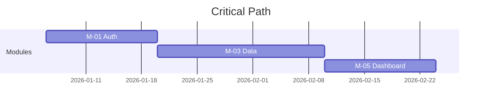

# DX Report Templates

## Architecture Decision Brief

Target: CTO, senior architects. Generated after /architect or /shape.

```markdown
# Architecture Decision Brief: {Project Name}

**Date**: {YYYY-MM-DD}
**Appetite**: {level} — {label} ({time budget})
**Solution Type**: {type}
**Modules**: {n} | **Features**: {must-haves} must-have + {nice-to-haves} nice-to-have
**Tracker**: {Linear/GitLab/GitHub} — {link}

## Executive Summary
{3-4 sentences: problem → solution direction → appetite → top risk.
This paragraph should be sufficient for someone who reads nothing else.}

## Architecture Snapshot
{C4 Container diagram (Mermaid)}

## Key Decisions
| # | Decision | Choice | Alternatives Considered | Risk |
|---|----------|--------|------------------------|------|
| ADR-0001 | {title} | {chosen} | {rejected options} | {low/med/high} |

## Module Map
| ID | Module | Appetite | Features | Dependencies | Risk |
|----|--------|----------|----------|-------------|------|
| M-01 | {name} | {level} | {n} | — | {low/med/high} |
| M-02 | {name} | {level} | {n} | M-01 | {low/med/high} |

## Critical Path
{Mermaid diagram showing the longest dependency chain with time estimates}



## Stack Alignment

{If a platform profile is active, list the canonical stack from the profile's
platform-stack skill and mark deviations.}

| Concern | Canonical Standard | This Project | Status |
|---------|-------------------|-------------|--------|
| Compute | {standard} | {choice} | ✓ / ⚠ deviation |
| Events | {standard} | {choice} | ✓ / ⚠ deviation |
| Auth | {standard} | {choice} | ✓ / ⚠ deviation |

## Risk Register (Top 5)
| # | Risk | Impact | Likelihood | Mitigation |
|---|------|--------|-----------|------------|
| R1 | {risk} | High | Medium | {mitigation} |

## Open Questions for Leadership
| # | Question | Options | Recommendation |
|---|----------|---------|----------------|
| Q1 | {question} | A, B, C | {recommendation} |

## Test Coverage
| Module | DQ Gates | Unit | Integration | Contract | E2E | Perf |
|--------|:--------:|:----:|:----------:|:--------:|:---:|:----:|
| M-01 | ✓ 4 gates | ✓ | ✓ | ✓ | ✓ | ✓ |
| M-02 | — | ✓ | ✓ | ✓ | — | — |

**CI/CD Pipeline**: {what runs on commit / merge / nightly / release}
**Test Infrastructure**: {what needs to be provisioned}

## Next Steps
| # | Action | Owner | By When |
|---|--------|-------|---------|
| 1 | {action} | {name/role} | {date} |
```

## Cycle Readiness Report

Target: Engineering leads. Generated before a build cycle.

```markdown
# Cycle Readiness: {Project Name}

**Target Cycle**: {start} → {end} ({n} weeks)
**Team**: {names or roles}

## Readiness Score: {n}/10

## Checklist
| Criterion | Status | Notes |
|-----------|--------|-------|
| Module specs complete | ✓/✗ | {n}/{total} done |
| API contracts defined | ✓/✗ | |
| ADRs accepted | ✓/✗ | {n} proposed, {n} accepted |
| No critical blockers | ✓/✗ | |
| Dev environment ready | ✓/✗ | |
| CI/CD pipeline exists | ✓/✗ | |
| Team assigned | ✓/✗ | |

## Module Readiness
| Module | Spec | APIs | Auth | Events | Infra | Tests | Ready? |
|--------|:----:|:----:|:----:|:------:|:-----:|:-----:|:------:|
| M-01 | ✓ | ✓ | ✓ | ✓ | ✗ | ✓ | ⚠ |

## Test Readiness
| Criterion | Status | Notes |
|-----------|--------|-------|
| TEST-PLAN.md exists | ✓/✗ | |
| Data quality gates defined | ✓/✗ | {n} gates across {n} layers |
| CI pipeline has test stages | ✓/✗ | commit / merge / nightly |
| Test fixtures available | ✓/✗ | |
| Integration infra (testcontainers, etc.) | ✓/✗ | |
| E2E setup complete | ✓/✗ | |
| Performance scenarios written | ✓/✗ | |
| Staging data available | ✓/✗ | Anonymized/synthetic |

## Blockers
| # | Blocker | Impact | Owner | ETA |
|---|---------|--------|-------|-----|

## Recommendation
{Go / No-Go / Conditional Go with specific conditions}
```

## Process Summary

Target: Process improvement. Generated after completion.

```markdown
# Process Summary: {Project Name}

## Timeline
| Phase | Duration | Notes |
|-------|----------|-------|
| Discover | {n} min/hours | |
| Shape | {n} min/hours | |
| Specify | {n} min/hours | {n} modules |
| Publish | {n} min | {tracker} |
| Total | {total} | |

## Output Metrics
| Metric | Value |
|--------|-------|
| Modules | {n} |
| Features (must-have) | {n} |
| Features (nice-to-have) | {n} |
| ADRs written | {n} |
| Issues published | {n} |
| Open questions | {n} remaining |
| Stack deviations | {n} |

## What Worked
- {observation}

## What to Improve
- {observation}

## Recommendations for Next Time
- {suggestion}
```
