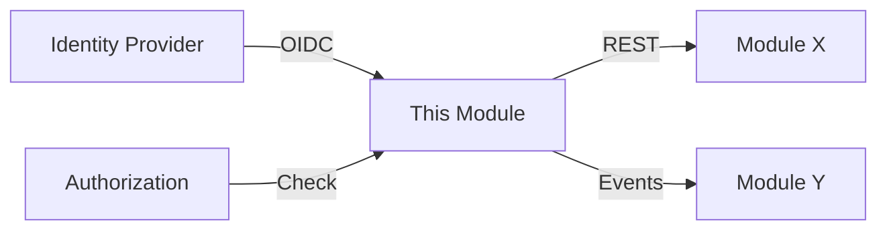

# Module Specification Template

Use this template for `docs/architect-process/architecture/modules/{nn}-{slug}/SPEC.md`.

Stack-specific sections (medallion mapping, Kafka topics, NGSI-LD publication,
SpiceDB schema) apply only when the active profile uses those technologies.
Load the active `platform-stack` skill to know which sections to include.

```markdown
# Module Specification: {Name}

**ID**: M-{nn}
**Version**: 0.1.0
**Status**: Draft | Review | Approved
**Appetite**: {level} — {label}
**Solution Type**: {type}
**Component**: {deployable component name — maps to SemVer}
**Current Version**: {current or "new component"}
**Target Version**: {target after this milestone}
**Containers**: {C4 containers this module implements}
**Team**: {recommended size}
**Dependencies**: {M-nn, M-nn}

---

## 1. Purpose

{2-3 sentences: what this module does, why it exists, who benefits.
Reference the original problem pitch.}

## 2. Architecture Context

{Where this module sits in the C4 Container diagram.
Which other modules it talks to and how.}



## 3. Features

### 3.1 F-{nn}.1: {Feature Title} [must-have]
{See feature-template.md}

### 3.2 F-{nn}.2: {Feature Title} [must-have]
{See feature-template.md}

### 3.3 ~F-{nn}.3: {Feature Title} [nice-to-have]
{See feature-template.md}

## 4. Data Model

### 4.1 Operational Entities
```mermaid
erDiagram
    ENTITY_A {
        uuid id PK
        {tenancy columns per active profile}
        string name
        jsonb metadata
        timestamptz created_at
        timestamptz updated_at
    }
```

### 4.2 Analytical / Time-Series Data (if applicable)
{If the profile defines a medallion architecture or similar analytical layer,
list the tables/layers here. Otherwise, skip.}

### 4.3 Event Contracts (if applicable)
{If the profile uses an event backbone, list topics/schemas here.
Use the profile's topic naming convention.}

### 4.4 External Publication (if applicable)
{If the profile has downstream publication targets — e.g., NGSI-LD, webhooks —
list them here. Otherwise, skip.}

## 5. API Contract

### 5.1 REST Endpoints
| Method | Path | Auth | Request | Response | Description |
|--------|------|------|---------|----------|-------------|

### 5.2 Event Contracts (AsyncAPI)
| Topic | Event | Schema | Notes |
|-------|-------|--------|-------|

## 6. Authorization Model

{Adapt to the active profile's authorization engine — role-based, attribute-based,
relationship-based (SpiceDB/Zanzibar), etc.}

| Action | AuthZ Check | Role/Permission |
|--------|-------------|-----------------|

## 7. Non-Functional Requirements

{Scale this section to solution type — minimal for Spike/Prototype, full for Production}

### Performance
- Throughput: {req/s or events/s}
- Latency: p50 < {ms}, p95 < {ms}, p99 < {ms}

### Scalability
- Strategy: {autoscaling, partitioning, read replicas}
- Expected scale: {concurrent users, data volume}

### Observability
- Custom metrics: {list}
- Log events: {list of structured log events}
- Trace spans: {list of span names}
- Dashboard: {description}
- Alerts: {conditions}

### Security
- Data classification: {public, internal, PII, sensitive}
- Encryption: {at rest, in transit}
- Audit: {what actions are audit-logged}

## 8. Open Questions

- [ ] {Question 1} — Owner: {who}
- [ ] {Question 2} — Owner: {who}

## 9. Dependencies

### Upstream (this module depends on)
| Module | Interface | What We Need |
|--------|----------|-------------|

### Downstream (depends on this module)
| Module | Interface | What They Need |
|--------|----------|---------------|

## 10. Risks

| Risk | Impact | Likelihood | Mitigation |
|------|--------|-----------|------------|
```
