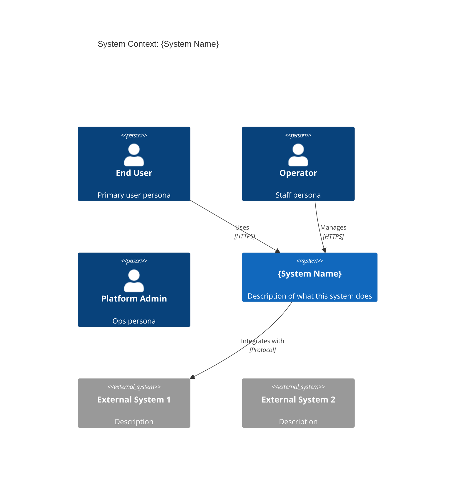
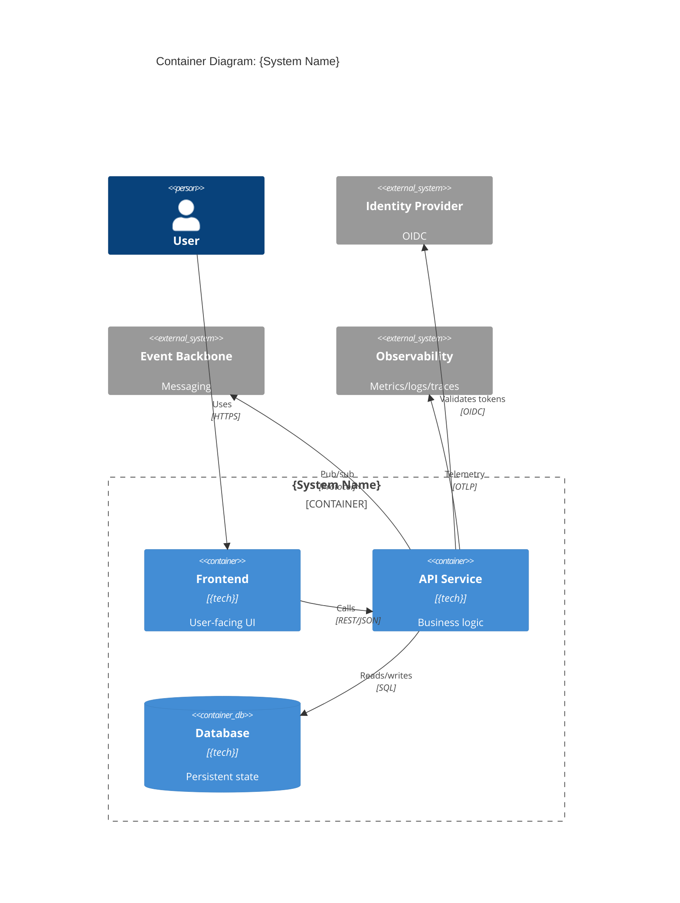
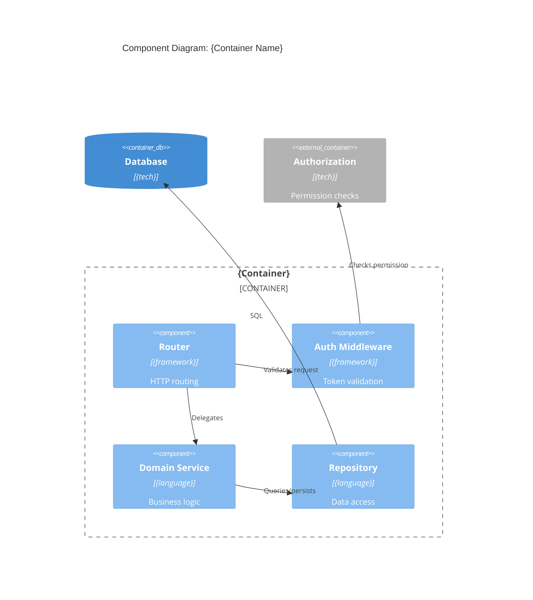
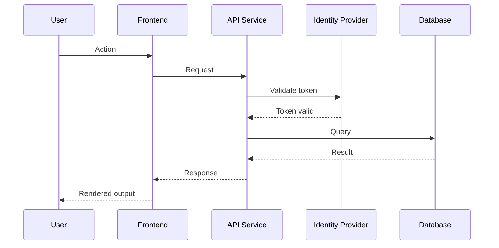

# C4 Mermaid Templates

Generic templates. For stack-specific container defaults, load the active
`platform-stack` skill — it will list the canonical containers for your stack.

## Level 1 — System Context

## Level 2 — Container

## Level 3 — Component (use sparingly)

## Dynamic Diagram — Sequence

## Tips
- Use `C4Context`, `C4Container`, `C4Component` Mermaid directives
- Keep Level 1 to ≤ 10 boxes
- Keep Level 2 to ≤ 15 boxes
- Level 3 only for the most complex container
- Always include the auth flow
- Always show the observability path
- Use `System_Ext` for anything outside your system boundary

## Profile Overrides

When a platform profile is active, it typically provides richer templates with
canonical container defaults (e.g., the Ubiwhere profile includes medallion
lakehouse containers, Keycloak+SpiceDB auth, Kafka event backbone). Load the
profile's `platform-stack` references for the canonical set.
